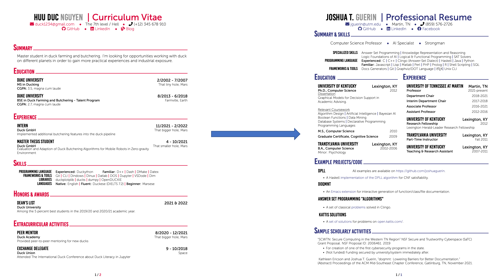

# Example Professional Resume
An example resume. To be used as an example for Senior Capstone Students.

## Compilation
* Dependencies require use of `xelatex` or `lualatex` (untested).

## Notes for Students
* This resume was built from my own experiences.
* Content/structure/etc. may not be appropriate for your academic experiences so far.
* To avoid everyone building the same resume, please avoid using this template. (There are many similarly constructed resumes out there that look just fine.)

## Updates
You will find that LaTeX is quite flexible in terms of modifications. Remember not to feel constrained by any single template you may be inspired by: use ideas from several to creat your own!

Below is a before and after of the resume template I downloaded vs. What I have made so far:

## References
* Template heavily modified modified from: [Huu Duc Nguyen's Template](https://www.overleaf.com/latex/templates/curriculum-vitae-latex/jqztwqchhypk)

More info to come.